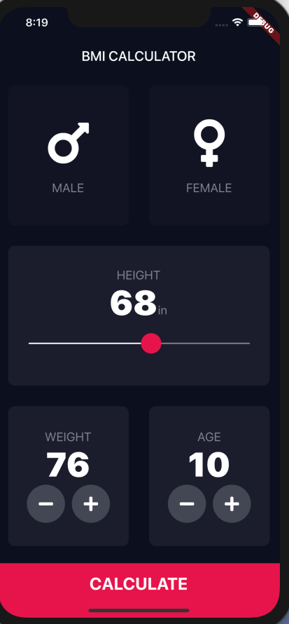
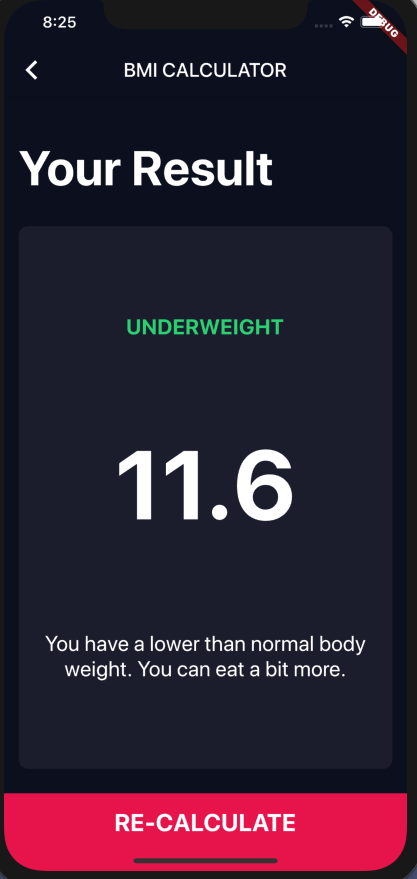

# My BMI Calculator

HOME PAGE



In this project, I built a Flutter app that calculated a person's BMI.

## Technology Used

* Flutter
* Dart
* Font Awesome Icons

RESULT PAGE



## What I Learned

- How to use Flutter themes to create coherent branding. 
- How to create multi-page apps using Flutter Routes and Navigator.
- How to extract and refactor Flutter Widgets with a click of the button. 
- How to pass functions as parameters and fields.
- How to use the GestureDetector Widget to detect more than just a tap.
- How to use custom colour palettes by using hex codes.
- How to customise Flutter Widgets to achieve a specific design style.
- Understand Dart Enums and the Ternary Operator.
- Learn about composition vs. inheritance and the Flutter way of creating custom UI.
- Understand the difference between const and final in Dart and when to use each.

## Example of Enum

An Enum is a way to categorize variables into a similar group. For example, in my code, I used
an enum called `Gender` which holds the variables, `female` and `male`. This it makes it easier to
organize the code.

```dart
enum Gender {female, male}

setState(() {
  selectedGender = Gender.male;
})
```

## Example of Ternary Operator

A ternary operator is similar to an if/then/else statement, but is condensed
into one line. In my example, if `selectedGender` is equal to `Gender.female`,
then the `color` is equal to `kContainerColor`. Else, the `color` is equal to
`kInactiveCardColor`.

```dart
color: selectedGender == Gender.female ? kContainerColor : kInactiveCardColor
```

## Example of Inheritance

Inheritance is used to get functionality of another Class using the keyword
`extends`. In my code, I inherited the `StatelessWidget` into my Class.

```dart
class BottomButton extends StatelessWidget{}
```